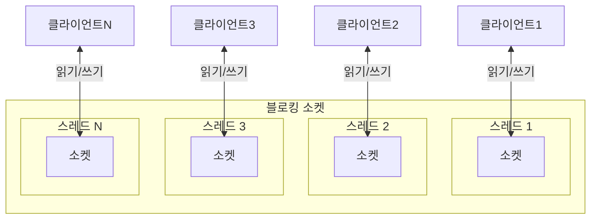
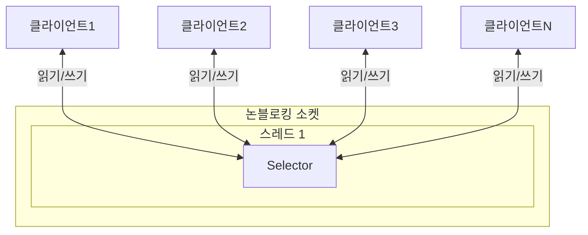

# Part1 Chapter2 주요 특징

> Netty is an asynchronous event-driven network application framework  
> for rapid development of maintainable high performance protocol servers & clients.  
>
> 비동기 이벤트 기반 네트워크 어플리케이션 프레임워크  
> 유지보수를 고려한 고성능 프로토콜 서버와 클라이언트를 빠르게 개발할 수 있다  

[Refer](https://netty.io/index.html)

Keyword

- 비동기
- 이벤트 기반
- 프로토콜 서버
- 빠른 개발

## 2.1 동기와 비동기

### 2.1.1 정의

https://www.websequencediagrams.com/

비동기 지원 디자인 패턴

- Future Pattern (Promise Pattern)
- Observer Pattern
- Reactor Pattern 

네티는 Reactor Pattern 사용  
네티는 비동기 호출을 위한 API들을 프레임워크 레벨에서 제공, 개발자가 스레드 동기화 이슈 및 그에 따른 버그를 신경쓰지 않고 구현에 집중  

## 2.2 블로킹과 논블로킹

소켓의 동작 방식은 블로킹 모드, 논블로킹 모드로 나뉨

JDK 1.3까지 블로킹 방식의 I/O만 지원  
JDK 1.4 NIO(New I/O)라는 논블로킹 I/O API 추가  
- 입출력 기능 제공
- 소켓도 입출력 채널의 하나로 NIO API를 사용
- 이를 통해 블로킹, 논블로킹 모드의 소켓을 사용

블로킹 소켓 - ServerSocket  
논블로킹 소켓 - ServerSocketChannel, SocketChannel  

### 2.2.1 블로킹 소켓

<details>
<summary>BlockingServer</summary>

```java
package com.github.nettybook.ch2;

import java.io.IOException;
import java.io.InputStream;
import java.io.OutputStream;
import java.net.ServerSocket;
import java.net.Socket;

public class BlockingServer {
    public static void main(String[] args) throws Exception {
        BlockingServer server = new BlockingServer();
        server.run();
    }

    private void run() throws IOException {
        ServerSocket server = new ServerSocket(8888);
        System.out.println("접속 대기중");

        while (true) {
            Socket sock = server.accept(); // 연결 클라이언트가 없으면 해당 라인 블로킹
            System.out.println("클라이언트 연결됨");

            OutputStream out = sock.getOutputStream();
            InputStream in = sock.getInputStream();

            while (true) {
                try {
                    int request = in.read(); // 클라이언트 접속 후 입력까지 블로킹
                    out.write(request); // 운영체제의 송신 버퍼에 전송할 데이터를 기록
                    // 이때 송신 버퍼의 남은 크기가 write 메서드에서 기록한 데이터의 크기보다 작다면 송신 버퍼가 비워질 때까지 블로킹
                }
                catch (IOException e) {
                    break;
                }
            }
        }
    }
}
```

입출력에서 스레드의 블로킹이 발생하기 때문에 동시에 여러 클라이언트에 대한 처리 불가

클라이언트별로 스레드를 할당하는 모델 등장
그러나 accept 메서드가 병목  
accept 메서드는 단위 시간에 하나의 연결만 처리하는 블로킹 모드로 동작하여 동시 접속 요청시 대기시간 증가  
또한 스레드가 증가함에 따라 OOM 발생 가능

이를 해결하기 위해 스레드풀 처리  
그러나 동시 접속 가능한 사용자 수가 스레드 풀에 지정된 스레드 수에 의존  
풀 사이즈 늘릴시 힙 사이즈 함께 증가 필요  
- 늘어난 힙 사이즈로 GC stop the world 시간 증가 문제
- 늘어난 풀 사이즈로 컨텍스트 스위칭 비용 증가 문제

<a href="https://github.com/krisjey/netty.book.kor/blob/master/example/src/java/com/github/nettybook/ch2/BlockingServer.java">Refer</a>

</details>

### 2.2.2 논블로킹 소켓 

<details>
<summary>NonBlockingServer</summary>

```java
package com.github.nettybook.ch2;

import java.io.IOException;
import java.net.InetSocketAddress;
import java.net.ServerSocket;
import java.net.SocketAddress;
import java.nio.ByteBuffer;
import java.nio.channels.SelectableChannel;
import java.nio.channels.SelectionKey;
import java.nio.channels.Selector;
import java.nio.channels.ServerSocketChannel;
import java.nio.channels.SocketChannel;
import java.util.ArrayList;
import java.util.HashMap;
import java.util.Iterator;
import java.util.List;
import java.util.Map;
import java.util.Set;

public class NonBlockingServer {
    private Map<SocketChannel, List<byte[]>> keepDataTrack = new HashMap<>();
    private ByteBuffer buffer = ByteBuffer.allocate(2 * 1024);

    private void startEchoServer() {
       try (
          Selector selector = Selector.open(); // 자신에게 등록된 채널에 변경 사항이 발생했는지 검사하고 변경 사항이 발생한 채널에 대한 접근을 가능하게 해준다
          ServerSocketChannel serverSocketChannel = ServerSocketChannel.open() // 논블로킹 소켓의 서버 소켓 채널
        ) {

          if ((serverSocketChannel.isOpen()) && (selector.isOpen())) {
             serverSocketChannel.configureBlocking(false); // 기본 true, 논블로킹 동작 설정
             serverSocketChannel.bind(new InetSocketAddress(8888)); // 포트 설정, 이 시점 부터 클라이언트의 연결 생성 가능

             serverSocketChannel.register(selector, SelectionKey.OP_ACCEPT); // ServerSocketChannel 객체를 Selector 객체에 등록, OP_ACCEPT 연결요청 이벤트 감지 
             System.out.println("접속 대기중");

             while (true) {
                selector.select(); // Selector에 등록된 채널에서 변경 사항이 발생했는지 검사
                // Selector에 I/O 이벤트 발생하지 않으면 블로킹, I/O 이벤트가 발생하지 않았을 때 블로킹을 피하고 싶다면 selectNow 메서드를 사용
                Iterator<SelectionKey> keys = selector.selectedKeys().iterator(); // Selector에 등록된 채널 중에서 I/O 이벤트가 발생한 채널 목록 조회

                while (keys.hasNext()) {
                   SelectionKey key = (SelectionKey) keys.next();
                   keys.remove(); // I/O 이벤트가 발생한 채널에서 동일한 이벤트가 감지되는 것을 방지, 조회된 목록에서 제거한다

                   if (!key.isValid()) {
                      continue;
                   }

                   if (key.isAcceptable()) { // I/O 이벤트의 종류가 연결요청인지 확인한다
                      this.acceptOP(key, selector);
                   }
                   else if (key.isReadable()) { // I/O 이벤트의 종류가 데이터 수신인지 확인한다
                      this.readOP(key);
                   }
                   else if (key.isWritable()) { // I/O 이벤트의 종류가 데이터 쓰기인지 확인한다
                      this.writeOP(key);
                   }
                }
             }
          }
          else {
             System.out.println("서버 소캣을 생성하지 못했습니다.");
          }
       }
       catch (IOException ex) {
          System.err.println(ex);
       }
    }

    private void acceptOP(SelectionKey key, Selector selector) throws IOException {
       ServerSocketChannel serverChannel = (ServerSocketChannel) key.channel(); // 연결 요청 이벤트가 발생한 채널은 항상 ServerSocketChannel 이므로 이벤트가 발생한 채널을 ServerSocketChannel로 캐스팅한다
       SocketChannel socketChannel = serverChannel.accept(); // ServerSocketChannel을 사용하여 클라이언트 연결을 수락하고 연결된 소켓 채널을 가져온다
       socketChannel.configureBlocking(false); // 연결된 클라이언트 소켓 채널을 논블로킹 모드로 설정

       System.out.println("클라이언트 연결됨 : " + socketChannel.getRemoteAddress());

       keepDataTrack.put(socketChannel, new ArrayList<byte[]>());
       socketChannel.register(selector, SelectionKey.OP_READ); // 클라이언트 소켓 채널을 Selector에 등록하여 I/O 이벤트 감시
    }

    private void readOP(SelectionKey key) {
       try {
          SocketChannel socketChannel = (SocketChannel) key.channel();
          buffer.clear();
          int numRead = -1;
          try {
             numRead = socketChannel.read(buffer);
          }
          catch (IOException e) {
             System.err.println("데이터 읽기 에러!");
          }

          if (numRead == -1) {
             this.keepDataTrack.remove(socketChannel);
             System.out.println("클라이언트 연결 종료 : "
                                + socketChannel.getRemoteAddress());
             socketChannel.close();
             key.cancel();
             return;
          }

          byte[] data = new byte[numRead];
          System.arraycopy(buffer.array(), 0, data, 0, numRead);
          System.out.println(new String(data, "UTF-8")
                              + " from " + socketChannel.getRemoteAddress());

          doEchoJob(key, data);
       }
       catch (IOException ex) {
          System.err.println(ex);
       }
    }

    private void writeOP(SelectionKey key) throws IOException {
       SocketChannel socketChannel = (SocketChannel) key.channel();

       List<byte[]> channelData = keepDataTrack.get(socketChannel);
       Iterator<byte[]> its = channelData.iterator();

       while (its.hasNext()) {
          byte[] it = its.next();
          its.remove();
          socketChannel.write(ByteBuffer.wrap(it));
       }

       key.interestOps(SelectionKey.OP_READ);
    }

    private void doEchoJob(SelectionKey key, byte[] data) {
       SocketChannel socketChannel = (SocketChannel) key.channel();
       List<byte[]> channelData = keepDataTrack.get(socketChannel);
       channelData.add(data);

       key.interestOps(SelectionKey.OP_WRITE);
    }

    public static void main(String[] args) {
       NonBlockingServer main = new NonBlockingServer();
       main.startEchoServer();
    }
 }
```

<a href="https://github.com/krisjey/netty.book.kor/blob/master/example/src/java/com/github/nettybook/ch2/NonBlockingServer.java">Refer</a>

</details>





