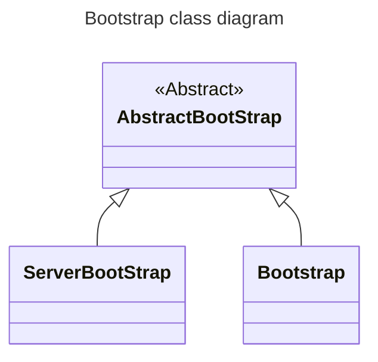
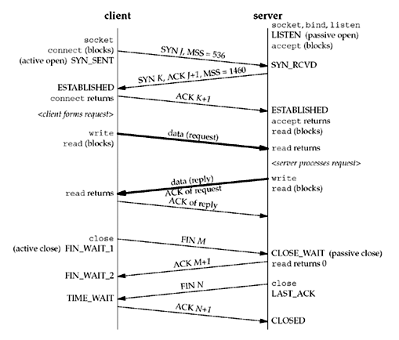
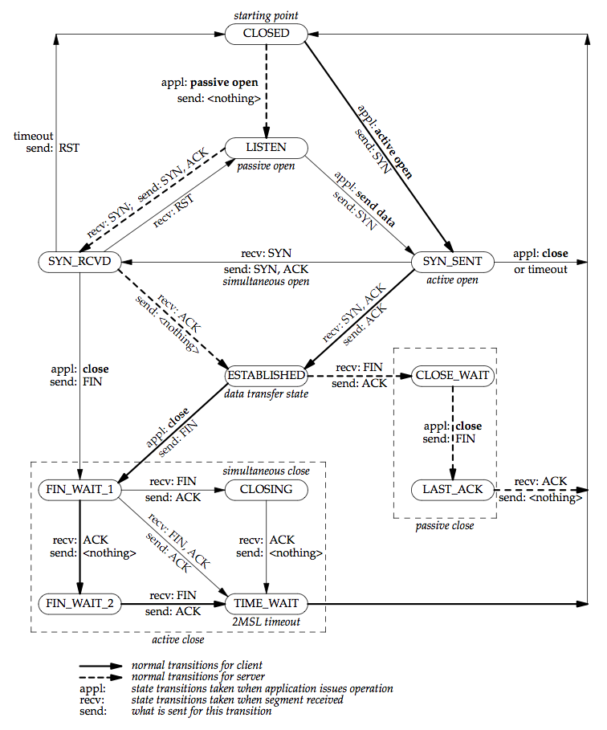

# Part2 Chapter3 부트스트랩

## 3.1 정의

네티로 작성한 네트워크 어플리케이션의 동작 방식과 환경을 설정하는 도우미 클래스

## 3.2 부트스트랩 구조

부트스트랩 논리 구조

- 전송 계층 (소켓 모드 및 I/O 종류)
- 이벤트 루프 (단일 스레드, 다중 스레드)
- 채널 파이프라인 설정
- 소켓 주소와 포트
- 소켓 옵션



## 3.3 ServerBootstrap

```java
package com.github.nettybook.ch3;

import io.netty.bootstrap.ServerBootstrap;
import io.netty.channel.ChannelFuture;
import io.netty.channel.ChannelInitializer;
import io.netty.channel.ChannelPipeline;
import io.netty.channel.EventLoopGroup;
import io.netty.channel.nio.NioEventLoopGroup;
import io.netty.channel.socket.SocketChannel;
import io.netty.channel.socket.nio.NioServerSocketChannel;

public class EchoServer {
    public static void main(String[] args) throws Exception {
        EventLoopGroup bossGroup = new NioEventLoopGroup(1); // 단일 스레드 동작 NioEventLoopGroup
        EventLoopGroup workerGroup = new NioEventLoopGroup(); // 생성자 인수가 없으므로 CPU 코어 수에 따른 스레드 수가 설정
        try {
            ServerBootstrap b = new ServerBootstrap();
            b.group(bossGroup, workerGroup)  // 부모 스레드는 클라이언트 연결 요청의 수락 담당, 자식 스레드는 연결된 소켓에 대한 I/O 처리를 담당
                    .channel(NioServerSocketChannel.class) // 서버 소켓(부모 스레드)이 사용할 네트워크 입출력 모드를 설정
                    .childHandler(new ChannelInitializer<SocketChannel>() { // 자식 채널의 초기화 방법 설정
                        @Override
                        public void initChannel(SocketChannel ch) { // 클라이언트로부터 연결된 채널이 초기화될 때의 기본 동작이 지정
                            ChannelPipeline p = ch.pipeline();
                            p.addLast(new EchoServerHandler()); // 채널 파이프라인에 핸들러 클래스 등록, 클라이언트의 연결이 생성되었을 때 데이터 처리를 담당
                        }
                    });

            ChannelFuture f = b.bind(8888).sync();
            f.channel().closeFuture().sync();
        } finally {
            workerGroup.shutdownGracefully();
            bossGroup.shutdownGracefully();
        }
    }
}
```

### 3.3.1 ServerBootstrap API

- group - 이벤트 루프 설정
- channel - 소켓 입출력 모드 설정
    - LocalServerChannel
        - 하나의 자바 가상머신에서 가상 통신을 위한 서버 소켓 채널을 생성하는 클래스
    - ~~OioServerSocketChannel~~ - @deprecated use NIO / EPOLL / KQUEUE transport.
        - 블로킹 모드 서버 소켓 채널을 생성하는 클래스
    - NioServerSocketChannel
        - 논블로킹 모드 서버 소켓 채널을 생성하는 클래스
    - EpollServerSocketChannel
        - 리눅스 커널의 epoll 입출력 모드를 지원하는 서버 소켓 채널을 생성하는 클래스
    - ~~OioSctpServerChannel~~ - @deprecated use {@link io.netty.channel.sctp.nio.NioSctpServerChannel}.
        - SCTP 전송 계층을 사용하는 블로킹 모드의 서버 소켓 채널을 생성하는 클래스
    - NioSctpServerChannel
        - SCTP 전송 계층을 사용하는 논블로킹 모드의 서버 소켓 채널을 생성하는 클래스
    - ~~NioUdtByteAcceptorChannel~~ - @deprecated The UDT transport is no longer maintained and will be removed.
        - UDT 프로토콜을 지원하는 논블로킹 모드의 서버 소켓 채널을 생성하는 클래스
        - 내부적으로 스트림 데이터를 처리하도록 구현되어 있으며 barchar-udt 라이브러리를 사용한다
    - ~~NioUdtMessageAcceptorChannel~~ - @deprecated The UDT transport is no longer maintained and will be removed.
        - UDT 프로토콜을 지원하는 논블로킹 모드의 서버 소켓 채널을 생성하는 클래스
        - 내부적으로 데이터그램 패킷을 처리하도록 구현되어 있다
- channelFactory - 소켓 입출력 모드 설정
- handler - 서버 소켓 채널의 이벤트 핸들러 설정
- childHandler - 소켓 채널의 데이터 가공 핸들러 설정
    - 클라이언트 소켓 채널로 송수신되는 데이터를 가공하는 데이터 핸들러 설정
- option - 서버 소켓 채널의 소켓 옵션 설정
    - @see io.netty.channel.ChannelOption 
    - | 옵션            | 설명                                                                                    | 기본값          |
      |---------------|---------------------------------------------------------------------------------------|--------------|
      | TCP_NODELAY   | 데이터 송수신에 [Nagle 알고리즘](https://en.wikipedia.org/wiki/Nagle's_algorithm)의 비활성화 여부를 지정한다 | false 비활성화   |
      | SO_KEEPALIVE  | 운영체제에서 지정된 시간에 한번씩 keepalive 패킷을 상대방에게 전송한다                                           | false 비활성화   |
      | SO_SNDBUF     | 상대방으로 송신할 커널 송신 버퍼의 크기                                                                | 커널 설정에 따라 다름 |
      | SO_RCVBUF     | 상대방으로부터 수신할 커널 수신 버퍼의 크기                                                              | 커널 설정에 따라 다름 |
      | SO_REUSEADDR  | TIME_WAIT 상태의 포트를 서버 소켓에 바인드할 수 있게 한다                                                 | false 비활성화   |
      | SO_LINGER     | 소켓을 닫을 때 커널의 송신 버퍼에 전송되지 않은 데이터의 전송 대기시간을 지정한다                                        | false 비활성화   |
      | SO_BACKLOG    | 동시에 수용 가능한 소켓 연결 요청 수                                                                 |
- childOption - 소켓 채널의 소켓 옵션 설정
  - 서버에 접속한 클라이언트 소켓 채널에 대한 옵션을 설정하는데 사용
  - SO_LINGER
    - close 메서드 호출시 커널 버퍼의 데이터를 상대방으로 모두 전송하고 상대방의 ACK 패킷을 기다린다.
    - 포트 상태가 TIME_WAIT로 전환되는 것을 방지하기 위해 SO_LINGER 활성화 및 0 설정
    - 0 일시 커널 버퍼에 남은 데이터를 상대방 소켓 채널로 모두 전송하고 즉시 연결을 끊는다
    - TIME_WAIT이 발생하지 않는 장점을 가지고 있지만 반대로 마지막으로 전송한 데이터가 클라이언트로 모두 전송되었는지 확인할 방법이 없음

### 3.3.2 Bootstrap API

- group - 이벤트 루프 설정
  - ServerBootstrap 에서와 달리 단 하나의 이벤트 루프만 설정
  - 클라이언트 어플리케이션은 서버에 연결한 소켓 채널하나만 가지고 있기 때문에 채널 이벤트를 처리할 이벤트 루프도 하나
- channel - 소켓 입출력 모드 설정
  - 클라이언트 소켓 채널만 설정
- channelFactory - 소켓 입출력 모드 설정
- handler - 클라이언트 소켓 채널의 이벤트 핸들러 설정
  - <details>
    <summary>EchoClient</summary>
    
    ```java
    package com.github.nettybook.ch3;
    
    import io.netty.bootstrap.Bootstrap;
    import io.netty.channel.ChannelFuture;
    import io.netty.channel.ChannelInitializer;
    import io.netty.channel.ChannelPipeline;
    import io.netty.channel.EventLoopGroup;
    import io.netty.channel.nio.NioEventLoopGroup;
    import io.netty.channel.socket.SocketChannel;
    import io.netty.channel.socket.nio.NioSocketChannel;
    
    /**
     * Sends one message when a connection is open and echoes back any received
     * data to the server.  Simply put, the echo client initiates the ping-pong
     * traffic between the echo client and server by sending the first message to
     * the server.
     */
    public final class EchoClient {
        public static void main(String[] args) throws Exception {
            EventLoopGroup group = new NioEventLoopGroup();
    
            try {
                Bootstrap b = new Bootstrap();
                b.group(group)
                 .channel(NioSocketChannel.class)
                 .handler(new ChannelInitializer<SocketChannel>() { // 클라이언트 소켓 채널의 이벤트 핸들러를 설정
                     @Override
                     public void initChannel(SocketChannel ch) throws Exception {
                         ChannelPipeline p = ch.pipeline();
                         p.addLast(new EchoClientHandler()); // 이벤트 핸들러 EchoClientHandler 등록
                     }
                 });
    
                ChannelFuture f = b.connect("localhost", 8888).sync();
    
                f.channel().closeFuture().sync();
            }
            finally {
                group.shutdownGracefully();
            }
        }
    }
    ```
    
    <a href="https://github.com/krisjey/netty.book.kor/blob/master/example/src/java/com/github/nettybook/ch3/EchoClient.java">Refer</a>
    
    </details>
- option - 소켓 채널의 소켓 옵션 설정
    - @see io.netty.channel.ChannelOption
    - 서버와 연결된 클라이언트 소켓 채널의 옵션 설정

## cf) UNIX NETWORK PROGRAMMING
https://slideplayer.com/slide/6812566/
https://notes.shichao.io/unp/ch2/

- TCP packet exchange

- TCP transition diagram

