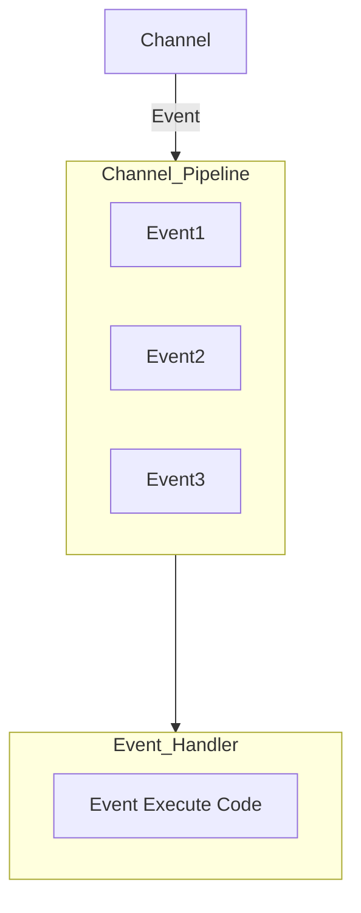
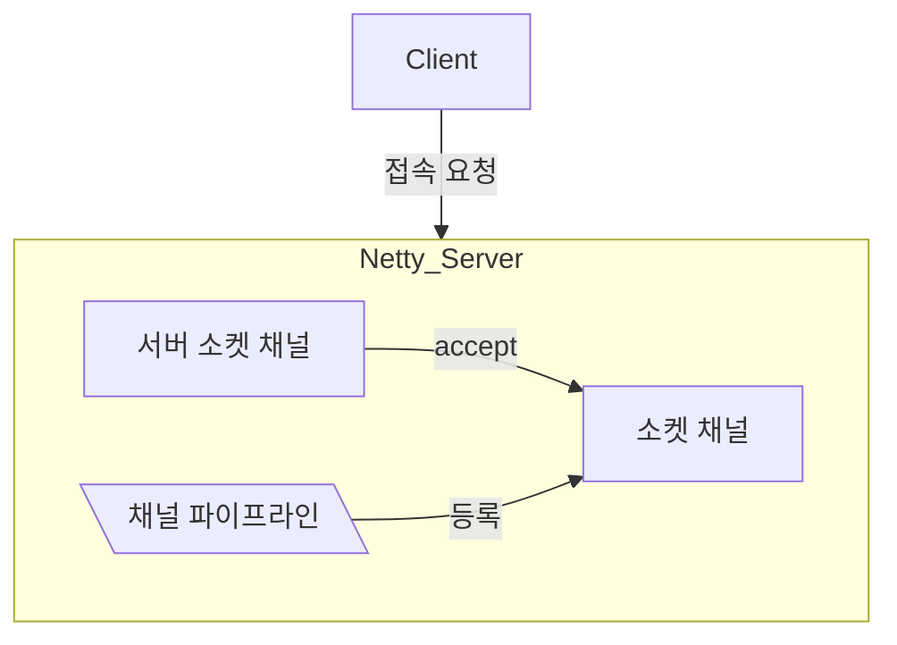
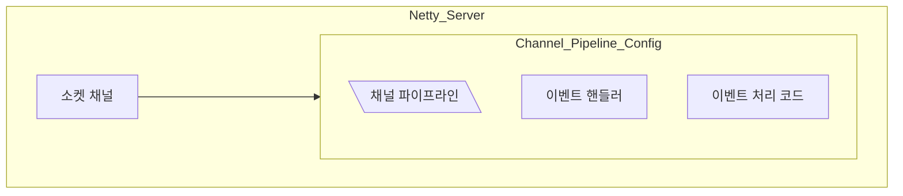
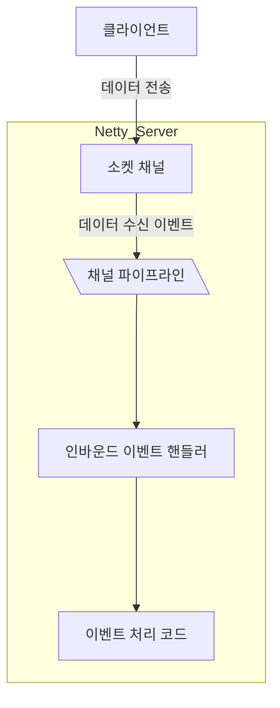
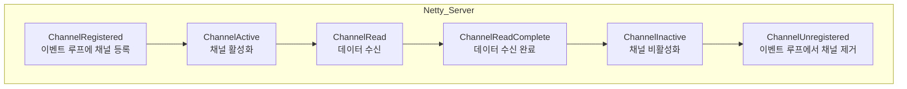
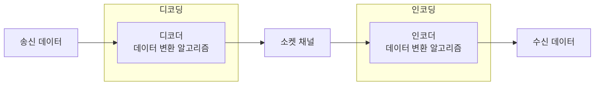

# Part2 Chapter4 채널 파이프라인, 코덱

## 4.1 이벤트 실행 

일반 서버 네트워크 프로그램 로직 구현 예시
1. 소켓에 데이터가 있는지 확인한다
2. 1에서 데이터가 존재하면 데이터를 읽어들이는 메서드를 호출
3. 읽어들일 데이터가 존재하지 않는다면 데이터가 도착할 때까지 기다린다
4. 데이터를 기다리는 중에 네트워크가 끊어지면 에러 처리를 위한 메서드를 호출한다

예외 대비가 철저할수록 오류는 적어지지만 복잡도는 증가  

이와 같은 관점에서 네티는 이벤트를 채널 파이프라인과 이벤트 핸들러로 추상화  
따라서 네티를 사용하면 데이터가 수신되었는지 소켓의 연결이 끊어졌는지와 같은 예외 상태에서 메서드 호출에 관여할 필요가 없다

앞에서 언급한 서버 네트워크 어플리케이션을 네티로 작성하면 다음과 같다
1. 부트스트랩으로 네트워크 어플리케이션에 필요한 설정을 지정
2. 부트스트랩에 이벤트 핸들러를 사용하여 채널 파이프라인을 구성
3. 이벤트 핸들러의 데이터 수신 이벤트 메서드에서 데이터를 읽어들인다
4. 이벤트 핸들러의 네트워크 끊김 이벤트 메서드에서 에러 처리를 한다

이벤트 메서드를 실행하는 방법
1. 네티의 이벤트 루프가 채널 파이프라인에 등록된 첫 번째 이벤트 핸들러를 가져온다
2. 이벤트 핸들러에 데이터 수신 이벤트 메서드가 구현되어 있으면 실행한다
3. 데이터 수신 이벤트 메서드가 구현되어 있지 않으면 다음 이벤트 핸들러를 가져온다
4. 2를 수행
5. 채널 파이프라인에 등록된 마지막 이벤트 핸들러에 도달할 때까지 1을 반복

## 4.2 채널 파이프라인

### 4.2.1 채널 파이프라인의 구조



### 4.2.2 채널 파이프라인 동작

1. 클라이언트 연결에 대응하는 소켓 채널 객체를 생성하고 빈 채널 파이프라인 객체를 생성하여 소켓 채널에 할당한다


2. 소켓 채널에 등록된 ChannelInitializer 인터페이스 구현체를 가져와서 initChannel 메서드를 호출한다

3. 소켓 채널 참조로부터 1에서 등록한 파이프라인 객체를 가져오고 채널 파이프라인에 입력된 이벤트 핸들러의 객체를 등록한다


세 단계 완료시 채널이 등록됐다는 이벤트가 발생  
이때부터 클라이언트 서버 간의 데이터 송수신을 위한 이벤트 처리가 시작

## 4.3 이벤트 핸들러

네티는 비동기 호출을 지원하는 두가지 패턴을 제공, Future Pattern, Reactor Pattern의 구현체인 이벤트 핸들러

1. 소켓 채널의 이벤트를 인터페이스로 정의하고   
2. 이를 상속 받은 이벤트 핸들러를 작성  
3. 채널 파이프라인에 등록  
4. 파이프라인으로 입력되는 이벤트를 이벤트 루프가 가로채어  
5. 이벤트에 해당하는 메서드를 수행하는 구조

### 4.3.1 채널 인바운드 이벤트

네티는 인바운드 이벤트를 ChannelInboundHandler 인터페이스로 제공

<details>
<summary>ChannelInboundHandler</summary>

```java
package io.netty.channel;

/**
 * {@link ChannelHandler} which adds callbacks for state changes. This allows the user
 * to hook in to state changes easily.
 */
public interface ChannelInboundHandler extends ChannelHandler {

    /**
     * The {@link Channel} of the {@link ChannelHandlerContext} was registered with its {@link EventLoop}
     */
    void channelRegistered(ChannelHandlerContext ctx) throws Exception;

    /**
     * The {@link Channel} of the {@link ChannelHandlerContext} was unregistered from its {@link EventLoop}
     */
    void channelUnregistered(ChannelHandlerContext ctx) throws Exception;

    /**
     * The {@link Channel} of the {@link ChannelHandlerContext} is now active
     */
    void channelActive(ChannelHandlerContext ctx) throws Exception;

    /**
     * The {@link Channel} of the {@link ChannelHandlerContext} was registered is now inactive and reached its
     * end of lifetime.
     */
    void channelInactive(ChannelHandlerContext ctx) throws Exception;

    /**
     * Invoked when the current {@link Channel} has read a message from the peer.
     */
    void channelRead(ChannelHandlerContext ctx, Object msg) throws Exception;

    /**
     * Invoked when the last message read by the current read operation has been consumed by
     * {@link #channelRead(ChannelHandlerContext, Object)}.  If {@link ChannelOption#AUTO_READ} is off, no further
     * attempt to read an inbound data from the current {@link Channel} will be made until
     * {@link ChannelHandlerContext#read()} is called.
     */
    void channelReadComplete(ChannelHandlerContext ctx) throws Exception;

    /**
     * Gets called if an user event was triggered.
     */
    void userEventTriggered(ChannelHandlerContext ctx, Object evt) throws Exception;

    /**
     * Gets called once the writable state of a {@link Channel} changed. You can check the state with
     * {@link Channel#isWritable()}.
     */
    void channelWritabilityChanged(ChannelHandlerContext ctx) throws Exception;

    /**
     * Gets called if a {@link Throwable} was thrown.
     */
    @Override
    @SuppressWarnings("deprecation")
    void exceptionCaught(ChannelHandlerContext ctx, Throwable cause) throws Exception;
}
```

</details>



클라이언트 접속, 데이터 전송, 연결 종료시 이벤트 흐름



1. ChannelRegistered
    - 서버와 클라이언트 상관없이 새로운 채널이 생성되는 시점에 발생한다
    - ```mermaid
        flowchart TD
        SSC_GEN[서버 소켓 채널\n생성 및 이벤트 루프 등록]
        SSC_REG[서버 소켓 채널\n**channelRegistered 이벤트]
        SSC_IDLE[서버 소켓 채널\naccept 대기]
        CLSC_GEN_ON_SV[클라이언트 소켓 채널\n생성 및 이벤트 루프 등록]
        CLSC_REG_ON_SV[클라이언트 소켓 채널\n**channelRegistered 이벤트]

        CN[connect 호출]
        CLSC_GEN_ON_CL[클라이언트 소켓 채널\n생성 및 이벤트 루프 등록]
        CLSC_REG_ON_CL[클라이언트 소켓 채널\n**channelRegistered 이벤트]

        SSC_GEN --> SSC_REG
        SSC_REG --> SSC_IDLE
        SSC_IDLE --accept--> CLSC_GEN_ON_SV
        CLSC_GEN_ON_SV ----> CLSC_REG_ON_SV

        CN --> CLSC_GEN_ON_CL
        CLSC_GEN_ON_CL --> CLSC_REG_ON_CL

        CLSC_REG_ON_CL --연결요청--> SSC_IDLE

            subgraph Netty_Server
                SSC_GEN
                SSC_REG
                SSC_IDLE
                CLSC_GEN_ON_SV
                CLSC_REG_ON_SV
            end

            subgraph Netty_Client
                CN
                CLSC_GEN_ON_CL
                CLSC_REG_ON_CL
            end    
        ```
2. ChannelActive
    - 채널이 생성되고 이벤트 루프에 등록된 이후에 네티 API를 사용하여 채널 입출력을 수행할 상태가 되었음을 알려주는 이벤트
    - 적합한 작업 예시
      - 서버 어플리케이션에 연결된 클라이언트의 연결 개수를 셀 때
      - 서버 어플리케이션에 연결된 클라이언트에게 최초 연결에 대한 메시지 전송
      - 클라이언트 어플리케이션이 연결된 서버에 최초 메세지 전송
      - 클라이언트 어플리케이션에서 서버에 연결된 상태에 대한 작업이 필요할 때
3. ChannelRead
    - 데이터 수신시 이벤트 발생
4. ChannelReadComplete
    - 데이터 수신 완료시 이벤트 발생
    - channelRead 이벤트는 채널에 데이터가 있을 때 발생, 채널의 데이터를 다 읽어서 더 이상 데이터가 없을 때 channelReadComplete 이벤트 발생
5. ChannelInactive
    - 채널이 비활성화 되었을 때 발생
    - 해당 이벤트 이후에는 채널에 대한 입출력 작업을 수행할 수 없다
6. ChannelUnregistered
    - 채널이 이벤트 루프에서 제거되었을 때 발생
    - 해당 이벤트 이후에는 채널에서 발생한 이벤트를 처리할 수 없다

### 4.3.2 채널 아웃바운드 이벤트

네티는 아웃바운드 이벤트를 ChannelOutboundHandler 인터페이스로 제공  
또한 모든 ChannelOutboundHandler 이벤트는 ChannelHandlerContext 객체를 인수로 받음  

ChannelHandlerContext는 두 가지 네티 객체에 대한 상호작용을 도와주는 인터페이스

1. 채널에 대한 입출력 처리
   - ex) writeAndFlush 메서드로 채널에 데이터를 기록, close 메서드로 채널의 연결을 종료할 수 있다

2. 채널 파이프라인에 대한 상호작용
   - 사용자에 의한 이벤트 발생과 채널 파이프라인에 등록된 이벤트 핸들러의 동적 변경
      - ChannelHandlerContext fireExceptionCaught 메서드를 호출하면 채널 파이프라인으로 exceptionCaught 이벤트가 전달되고 해당 이벤트 메서드가 수행
      - 채널이 초기화될 때 설정된 채널 파이프라인을 가져오는 메서드를 제공, 그러므로 ChannelHandlerContext를 통해서 설정된 채널 파이프라인을 수정할 수 있다

<details>
<summary>ChannelOutboundHandler</summary>

```java
package io.netty.channel;

import java.net.SocketAddress;

/**
 * {@link ChannelHandler} which will get notified for IO-outbound-operations.
 */
public interface ChannelOutboundHandler extends ChannelHandler {
    /**
     * Called once a bind operation is made.
     *
     * @param ctx           the {@link ChannelHandlerContext} for which the bind operation is made
     * @param localAddress  the {@link SocketAddress} to which it should bound
     * @param promise       the {@link ChannelPromise} to notify once the operation completes
     * @throws Exception    thrown if an error occurs
     */
    void bind(ChannelHandlerContext ctx, SocketAddress localAddress, ChannelPromise promise) throws Exception;

    /**
     * Called once a connect operation is made.
     *
     * @param ctx               the {@link ChannelHandlerContext} for which the connect operation is made
     * @param remoteAddress     the {@link SocketAddress} to which it should connect
     * @param localAddress      the {@link SocketAddress} which is used as source on connect
     * @param promise           the {@link ChannelPromise} to notify once the operation completes
     * @throws Exception        thrown if an error occurs
     */
    void connect(
            ChannelHandlerContext ctx, SocketAddress remoteAddress,
            SocketAddress localAddress, ChannelPromise promise) throws Exception;

    /**
     * Called once a disconnect operation is made.
     *
     * @param ctx               the {@link ChannelHandlerContext} for which the disconnect operation is made
     * @param promise           the {@link ChannelPromise} to notify once the operation completes
     * @throws Exception        thrown if an error occurs
     */
    void disconnect(ChannelHandlerContext ctx, ChannelPromise promise) throws Exception;

    /**
     * Called once a close operation is made.
     *
     * @param ctx               the {@link ChannelHandlerContext} for which the close operation is made
     * @param promise           the {@link ChannelPromise} to notify once the operation completes
     * @throws Exception        thrown if an error occurs
     */
    void close(ChannelHandlerContext ctx, ChannelPromise promise) throws Exception;

    /**
     * Called once a deregister operation is made from the current registered {@link EventLoop}.
     *
     * @param ctx               the {@link ChannelHandlerContext} for which the close operation is made
     * @param promise           the {@link ChannelPromise} to notify once the operation completes
     * @throws Exception        thrown if an error occurs
     */
    void deregister(ChannelHandlerContext ctx, ChannelPromise promise) throws Exception;

    /**
     * Intercepts {@link ChannelHandlerContext#read()}.
     */
    void read(ChannelHandlerContext ctx) throws Exception;

    /**
    * Called once a write operation is made. The write operation will write the messages through the
     * {@link ChannelPipeline}. Those are then ready to be flushed to the actual {@link Channel} once
     * {@link Channel#flush()} is called
     *
     * @param ctx               the {@link ChannelHandlerContext} for which the write operation is made
     * @param msg               the message to write
     * @param promise           the {@link ChannelPromise} to notify once the operation completes
     * @throws Exception        thrown if an error occurs
     */
    void write(ChannelHandlerContext ctx, Object msg, ChannelPromise promise) throws Exception;

    /**
     * Called once a flush operation is made. The flush operation will try to flush out all previous written messages
     * that are pending.
     *
     * @param ctx               the {@link ChannelHandlerContext} for which the flush operation is made
     * @throws Exception        thrown if an error occurs
     */
    void flush(ChannelHandlerContext ctx) throws Exception;
}
```

</details>

<details>
<summary>ChannelHandlerContext</summary>

```java
package io.netty.channel;

import io.netty.buffer.ByteBuf;
import io.netty.buffer.ByteBufAllocator;
import io.netty.util.Attribute;
import io.netty.util.AttributeKey;
import io.netty.util.AttributeMap;
import io.netty.util.concurrent.EventExecutor;

/**
 * Enables a {@link ChannelHandler} to interact with its {@link ChannelPipeline}
 * and other handlers. Among other things a handler can notify the next {@link ChannelHandler} in the
 * {@link ChannelPipeline} as well as modify the {@link ChannelPipeline} it belongs to dynamically.
 *
 * <h3>Notify</h3>
 *
 * You can notify the closest handler in the same {@link ChannelPipeline} by calling one of the various methods
 * provided here.
 *
 * Please refer to {@link ChannelPipeline} to understand how an event flows.
 *
 * <h3>Modifying a pipeline</h3>
 *
 * You can get the {@link ChannelPipeline} your handler belongs to by calling
 * {@link #pipeline()}.  A non-trivial application could insert, remove, or
 * replace handlers in the pipeline dynamically at runtime.
 *
 * <h3>Retrieving for later use</h3>
 *
 * You can keep the {@link ChannelHandlerContext} for later use, such as
 * triggering an event outside the handler methods, even from a different thread.
 * <pre>
 * public class MyHandler extends {@link ChannelDuplexHandler} {
 *
 *     <b>private {@link ChannelHandlerContext} ctx;</b>
 *
 *     public void beforeAdd({@link ChannelHandlerContext} ctx) {
 *         <b>this.ctx = ctx;</b>
 *     }
 *
 *     public void login(String username, password) {
 *         ctx.write(new LoginMessage(username, password));
 *     }
 *     ...
 * }
 * </pre>
 *
 * <h3>Storing stateful information</h3>
 *
 * {@link #attr(AttributeKey)} allow you to
 * store and access stateful information that is related with a {@link ChannelHandler} / {@link Channel} and its
 * context. Please refer to {@link ChannelHandler} to learn various recommended
 * ways to manage stateful information.
 *
 * <h3>A handler can have more than one {@link ChannelHandlerContext}</h3>
 *
 * Please note that a {@link ChannelHandler} instance can be added to more than
 * one {@link ChannelPipeline}.  It means a single {@link ChannelHandler}
 * instance can have more than one {@link ChannelHandlerContext} and therefore
 * the single instance can be invoked with different
 * {@link ChannelHandlerContext}s if it is added to one or more {@link ChannelPipeline}s more than once.
 * Also note that a {@link ChannelHandler} that is supposed to be added to multiple {@link ChannelPipeline}s should
 * be marked as {@link io.netty.channel.ChannelHandler.Sharable}.
 *
 * <h3>Additional resources worth reading</h3>
 * <p>
 * Please refer to the {@link ChannelHandler}, and
 * {@link ChannelPipeline} to find out more about inbound and outbound operations,
 * what fundamental differences they have, how they flow in a  pipeline,  and how to handle
 * the operation in your application.
 */
public interface ChannelHandlerContext extends AttributeMap, ChannelInboundInvoker, ChannelOutboundInvoker {

    /**
     * Return the {@link Channel} which is bound to the {@link ChannelHandlerContext}.
     */
    Channel channel();

    /**
     * Returns the {@link EventExecutor} which is used to execute an arbitrary task.
     */
    EventExecutor executor();

    /**
     * The unique name of the {@link ChannelHandlerContext}.The name was used when then {@link ChannelHandler}
     * was added to the {@link ChannelPipeline}. This name can also be used to access the registered
     * {@link ChannelHandler} from the {@link ChannelPipeline}.
     */
    String name();

    /**
     * The {@link ChannelHandler} that is bound this {@link ChannelHandlerContext}.
     */
    ChannelHandler handler();

    /**
     * Return {@code true} if the {@link ChannelHandler} which belongs to this context was removed
     * from the {@link ChannelPipeline}. Note that this method is only meant to be called from with in the
     * {@link EventLoop}.
     */
    boolean isRemoved();

    @Override
    ChannelHandlerContext fireChannelRegistered();

    @Override
    ChannelHandlerContext fireChannelUnregistered();

    @Override
    ChannelHandlerContext fireChannelActive();

    @Override
    ChannelHandlerContext fireChannelInactive();

    @Override
    ChannelHandlerContext fireExceptionCaught(Throwable cause);

    @Override
    ChannelHandlerContext fireUserEventTriggered(Object evt);

    @Override
    ChannelHandlerContext fireChannelRead(Object msg);

    @Override
    ChannelHandlerContext fireChannelReadComplete();

    @Override
    ChannelHandlerContext fireChannelWritabilityChanged();

    @Override
    ChannelHandlerContext read();

    @Override
    ChannelHandlerContext flush();

    /**
     * Return the assigned {@link ChannelPipeline}
     */
    ChannelPipeline pipeline();

    /**
     * Return the assigned {@link ByteBufAllocator} which will be used to allocate {@link ByteBuf}s.
     */
    ByteBufAllocator alloc();

    /**
     * @deprecated Use {@link Channel#attr(AttributeKey)}
     */
    @Deprecated
    @Override
    <T> Attribute<T> attr(AttributeKey<T> key);

    /**
     * @deprecated Use {@link Channel#hasAttr(AttributeKey)}
     */
    @Deprecated
    @Override
    <T> boolean hasAttr(AttributeKey<T> key);
}
```

</details>

1. bind 이벤트
   - 서버 소켓 채널이 클라이언트의 연결을 대기하는 IP와 포트가 설정되었을 때 발생
   - 서버 소켓 채널이 사용 중인 SocketAddress 객체가 인수로 입력됨
2. connect 이벤트
   - 클라이언트 소켓 채널이 서버에 연결되었을 때 발생
   - 원격지 SocketAddress 정보와 로컬 SocketAddress 정보가 인수로 입력됨
3. disconnect 이벤트
   - 클라이언트 소켓 채널의 연결이 끊어졌을 때 발생
4. close 이벤트
   - 클라이언트 소켓 채널의 연결이 닫혔을 때 발생
5. write 이벤트
   - 소켓 채널에 데이터가 기록되었을 때 발생
   - 소켓 채널에 기록된 데이터 버퍼가 인수로 입력됨
6. flush 이벤트
   - 소켓 채널에 대한 flush 메서드가 호출되었을 때 발생

### 4.3.3 이벤트 이동 경로와 이벤트 메서드 실행


<details>
<summary>여러개의 이벤트 핸들러가 등록되어 있을 때 이벤트에 해당하는 이벤트 메서드가 실행된다</summary>

```java
package com.github.nettybook.ch4;

import io.netty.bootstrap.ServerBootstrap;
import io.netty.channel.ChannelFuture;
import io.netty.channel.ChannelInitializer;
import io.netty.channel.ChannelPipeline;
import io.netty.channel.EventLoopGroup;
import io.netty.channel.nio.NioEventLoopGroup;
import io.netty.channel.socket.SocketChannel;
import io.netty.channel.socket.nio.NioServerSocketChannel;

public class EchoServerV3 {
    public static void main(String[] args) throws Exception {
        EventLoopGroup bossGroup = new NioEventLoopGroup(1);
        EventLoopGroup workerGroup = new NioEventLoopGroup();
        try {
            ServerBootstrap b = new ServerBootstrap();
            b.group(bossGroup, workerGroup)
             .channel(NioServerSocketChannel.class)
             .childHandler(new ChannelInitializer<SocketChannel>() {
                @Override
                public void initChannel(SocketChannel ch) {
                    ChannelPipeline p = ch.pipeline();
                    p.addLast(new EchoServerV3FirstHandler());
                    p.addLast(new EchoServerV3SecondHandler());
                }
            });

            ChannelFuture f = b.bind(8888).sync();
            f.channel().closeFuture().sync();
        }
        finally {
            workerGroup.shutdownGracefully();
            bossGroup.shutdownGracefully();
        }
    }
}
```

```java
package com.github.nettybook.ch4;

import java.nio.charset.Charset;

import io.netty.buffer.ByteBuf;
import io.netty.channel.ChannelHandlerContext;
import io.netty.channel.ChannelInboundHandlerAdapter;

/**
 * Handler implementation for the echo server.
 */
public class EchoServerV3FirstHandler extends ChannelInboundHandlerAdapter {
    @Override
    public void channelRead(ChannelHandlerContext ctx, Object msg) {
        ByteBuf readMessage = (ByteBuf) msg;
        System.out.println("channelRead : " + readMessage.toString(Charset.defaultCharset()));
        ctx.write(msg);
    }
}
```

```java
package com.github.nettybook.ch4;

import io.netty.channel.ChannelHandlerContext;
import io.netty.channel.ChannelInboundHandlerAdapter;

/**
 * Handler implementation for the echo server.
 */
public class EchoServerV3SecondHandler extends ChannelInboundHandlerAdapter {
    @Override
    public void channelReadComplete(ChannelHandlerContext ctx) {
        System.out.println("channelReadComplete 발생");
        ctx.flush();
    }

    @Override
    public void exceptionCaught(ChannelHandlerContext ctx, Throwable cause) {
        cause.printStackTrace();
        ctx.close();
    }
}
```

</details>

<details>
<summary>하나의 이벤트는 하나의 이벤트 메서드만 수행한다</summary>

```java
package com.github.nettybook.ch4;

import io.netty.bootstrap.ServerBootstrap;
import io.netty.channel.ChannelFuture;
import io.netty.channel.ChannelInitializer;
import io.netty.channel.ChannelPipeline;
import io.netty.channel.EventLoopGroup;
import io.netty.channel.nio.NioEventLoopGroup;
import io.netty.channel.socket.SocketChannel;
import io.netty.channel.socket.nio.NioServerSocketChannel;

public class EchoServerV4 {
    public static void main(String[] args) throws Exception {
        EventLoopGroup bossGroup = new NioEventLoopGroup(1);
        EventLoopGroup workerGroup = new NioEventLoopGroup();
        try {
            ServerBootstrap b = new ServerBootstrap();
            b.group(bossGroup, workerGroup)
             .channel(NioServerSocketChannel.class)
             .childHandler(new ChannelInitializer<SocketChannel>() {
                @Override
                public void initChannel(SocketChannel ch) {
                    ChannelPipeline p = ch.pipeline();
                    p.addLast(new EchoServerV4FirstHandler());
                    p.addLast(new EchoServerV4SecondHandler());
                }
            });

            ChannelFuture f = b.bind(8888).sync();
            f.channel().closeFuture().sync();
        }
        finally {
            workerGroup.shutdownGracefully();
            bossGroup.shutdownGracefully();
        }
    }
}
```

```java
package com.github.nettybook.ch4;

import java.nio.charset.Charset;

import io.netty.buffer.ByteBuf;
import io.netty.channel.ChannelHandlerContext;
import io.netty.channel.ChannelInboundHandlerAdapter;

/**
 * Handler implementation for the echo server.
 */
public class EchoServerV4FirstHandler extends ChannelInboundHandlerAdapter {
    @Override
    public void channelRead(ChannelHandlerContext ctx, Object msg) {
        ByteBuf readMessage = (ByteBuf) msg;
        System.out.println("FirstHandler channelRead : " + readMessage.toString(Charset.defaultCharset()));
        ctx.write(msg);
        ctx.fireChannelRead(msg);
    }
}
```

```java
package com.github.nettybook.ch4;

import java.nio.charset.Charset;

import io.netty.buffer.ByteBuf;
import io.netty.channel.ChannelHandlerContext;
import io.netty.channel.ChannelInboundHandlerAdapter;

/**
 * Handler implementation for the echo server.
 */
public class EchoServerV4SecondHandler extends ChannelInboundHandlerAdapter {
    @Override
    public void channelRead(ChannelHandlerContext ctx, Object msg) {
        ByteBuf readMessage = (ByteBuf) msg;
        System.out.println("SecondHandler channelRead : " + readMessage.toString(Charset.defaultCharset()));
    }
    
    @Override
    public void channelReadComplete(ChannelHandlerContext ctx) {
        System.out.println("channelReadComplete 발생");
        ctx.flush();
    }

    @Override
    public void exceptionCaught(ChannelHandlerContext ctx, Throwable cause) {
        cause.printStackTrace();
        ctx.close();
    }
}
```

```log
FirstHandler channelRead: a
channelReadComplete 발생
FirstHandler channelRead: s
channelReadComplete 발생
FirstHandler channelRead: d
channelReadComplete 발생
FirstHandler channelRead: f
channelReadComplete 발생
```

만약 두 번째 이벤트 핸들러의 channelRead 메서드도 수행하고 싶다면  
첫 번째 이벤트 핸들러 코드를 다음과 같이 수정
ChannelHandlerContext 인터페이스를 사용하여 채널 파이프라인에 이벤트를 발생

```java
package com.github.nettybook.ch4;

import java.nio.charset.Charset;

import io.netty.buffer.ByteBuf;
import io.netty.channel.ChannelHandlerContext;
import io.netty.channel.ChannelInboundHandlerAdapter;

/**
 * Handler implementation for the echo server.
 */
public class EchoServerV4FirstHandler extends ChannelInboundHandlerAdapter {
   @Override
   public void channelRead(ChannelHandlerContext ctx, Object msg) {
      ByteBuf readMessage = (ByteBuf) msg;
      System.out.println("FirstHandler channelRead : " + readMessage.toString(Charset.defaultCharset()));
      ctx.write(msg);
      ctx.fireChannelRead(msg); // fireChannelRead 메서드를 호출하면 채널 파이프라인에 channelRead 이벤트를 발생시킨다
   }
}
```

</details>

### 4.3.4 코덱

인코더는 전송할 데이터를 전송 프로토콜에 맞추어 변환 작업을 수행  
디코더는 반대 작업을 수행



## 4.4 코덱의 구조

데이터를 전송할 때는 인코더를 사용하여 패킷으로 변환하고  
데이터를 수신할 때는 디코더를 사용하여 패킷을 데이터로 변환한다  

### 4.4.1 코덱의 실행 과정

네티의 코덱은 템플릿 메서드 패턴으로 구현되어 있다  
상위 구현체에서 메서드의 실행 순서만을 지정하고 수행될 메서드의 구현은 하위 구현체로 위임

<details>
<summary>Base64Encoder 예제</summary>

```java
package io.netty.handler.codec.base64;

import io.netty.buffer.ByteBuf;
import io.netty.channel.ChannelHandler.Sharable;
import io.netty.channel.ChannelHandlerContext;
import io.netty.channel.ChannelPipeline;
import io.netty.handler.codec.DelimiterBasedFrameDecoder;
import io.netty.handler.codec.Delimiters;
import io.netty.handler.codec.MessageToMessageEncoder;
import io.netty.util.internal.ObjectUtil;

import java.util.List;

/**
 * Encodes a {@link ByteBuf} into a Base64-encoded {@link ByteBuf}.
 * A typical setup for TCP/IP would be:
 * <pre>
 * {@link ChannelPipeline} pipeline = ...;
 *
 * // Decoders
 * pipeline.addLast("frameDecoder", new {@link DelimiterBasedFrameDecoder}(80, {@link Delimiters#nulDelimiter()}));
 * pipeline.addLast("base64Decoder", new {@link Base64Decoder}());
 *
 * // Encoder
 * pipeline.addLast("base64Encoder", new {@link Base64Encoder}());
 * </pre>
 */
@Sharable
public class Base64Encoder extends MessageToMessageEncoder<ByteBuf> {

    private final boolean breakLines;
    private final Base64Dialect dialect;

    public Base64Encoder() {
        this(true);
    }

    public Base64Encoder(boolean breakLines) {
        this(breakLines, Base64Dialect.STANDARD);
    }

    public Base64Encoder(boolean breakLines, Base64Dialect dialect) {
        this.dialect = ObjectUtil.checkNotNull(dialect, "dialect");
        this.breakLines = breakLines;
    }

    @Override
    protected void encode(ChannelHandlerContext ctx, ByteBuf msg, List<Object> out) throws Exception {
        out.add(Base64.encode(msg, msg.readerIndex(), msg.readableBytes(), breakLines, dialect));
    }
}
```

```java
package io.netty.handler.codec;

import io.netty.channel.ChannelHandlerContext;
import io.netty.channel.ChannelOutboundHandler;
import io.netty.channel.ChannelOutboundHandlerAdapter;
import io.netty.channel.ChannelPipeline;
import io.netty.channel.ChannelPromise;
import io.netty.util.ReferenceCountUtil;
import io.netty.util.ReferenceCounted;
import io.netty.util.concurrent.PromiseCombiner;
import io.netty.util.internal.PlatformDependent;
import io.netty.util.internal.StringUtil;
import io.netty.util.internal.TypeParameterMatcher;

import java.util.List;

/**
 * {@link ChannelOutboundHandlerAdapter} which encodes from one message to an other message
 *
 * For example here is an implementation which decodes an {@link Integer} to an {@link String}.
 *
 * <pre>
 *     public class IntegerToStringEncoder extends
 *             {@link MessageToMessageEncoder}&lt;{@link Integer}&gt; {
 *
 *         {@code @Override}
 *         public void encode({@link ChannelHandlerContext} ctx, {@link Integer} message, List&lt;Object&gt; out)
 *                 throws {@link Exception} {
 *             out.add(message.toString());
 *         }
 *     }
 * </pre>
 *
 * Be aware that you need to call {@link ReferenceCounted#retain()} on messages that are just passed through if they
 * are of type {@link ReferenceCounted}. This is needed as the {@link MessageToMessageEncoder} will call
 * {@link ReferenceCounted#release()} on encoded messages.
 */
public abstract class MessageToMessageEncoder<I> extends ChannelOutboundHandlerAdapter {

    private final TypeParameterMatcher matcher;

    /**
     * Create a new instance which will try to detect the types to match out of the type parameter of the class.
     */
    protected MessageToMessageEncoder() {
        matcher = TypeParameterMatcher.find(this, MessageToMessageEncoder.class, "I");
    }

    /**
     * Create a new instance
     *
     * @param outboundMessageType   The type of messages to match and so encode
     */
    protected MessageToMessageEncoder(Class<? extends I> outboundMessageType) {
        matcher = TypeParameterMatcher.get(outboundMessageType);
    }

    /**
     * Returns {@code true} if the given message should be handled. If {@code false} it will be passed to the next
     * {@link ChannelOutboundHandler} in the {@link ChannelPipeline}.
     */
    public boolean acceptOutboundMessage(Object msg) throws Exception {
        return matcher.match(msg);
    }

    @Override
    public void write(ChannelHandlerContext ctx, Object msg, ChannelPromise promise) throws Exception {
        CodecOutputList out = null;
        try {
            if (acceptOutboundMessage(msg)) {
                out = CodecOutputList.newInstance();
                @SuppressWarnings("unchecked")
                I cast = (I) msg;
                try {
                    encode(ctx, cast, out); // 추상 메서드 encode 호출
                } catch (Throwable th) {
                    ReferenceCountUtil.safeRelease(cast);
                    PlatformDependent.throwException(th);
                }
                ReferenceCountUtil.release(cast);

                if (out.isEmpty()) {
                    throw new EncoderException(
                            StringUtil.simpleClassName(this) + " must produce at least one message.");
                }
            } else {
                ctx.write(msg, promise);
            }
        } catch (EncoderException e) {
            throw e;
        } catch (Throwable t) {
            throw new EncoderException(t);
        } finally {
            if (out != null) {
                try {
                    final int sizeMinusOne = out.size() - 1;
                    if (sizeMinusOne == 0) {
                        ctx.write(out.getUnsafe(0), promise);
                    } else if (sizeMinusOne > 0) {
                        // Check if we can use a voidPromise for our extra writes to reduce GC-Pressure
                        // See https://github.com/netty/netty/issues/2525
                        if (promise == ctx.voidPromise()) {
                            writeVoidPromise(ctx, out);
                        } else {
                            writePromiseCombiner(ctx, out, promise);
                        }
                    }
                } finally {
                    out.recycle();
                }
            }
        }
    }

    private static void writeVoidPromise(ChannelHandlerContext ctx, CodecOutputList out) {
        final ChannelPromise voidPromise = ctx.voidPromise();
        for (int i = 0; i < out.size(); i++) {
            ctx.write(out.getUnsafe(i), voidPromise);
        }
    }

    private static void writePromiseCombiner(ChannelHandlerContext ctx, CodecOutputList out, ChannelPromise promise) {
        final PromiseCombiner combiner = new PromiseCombiner(ctx.executor());
        for (int i = 0; i < out.size(); i++) {
            combiner.add(ctx.write(out.getUnsafe(i)));
        }
        combiner.finish(promise);
    }

    /**
     * Encode from one message to an other. This method will be called for each written message that can be handled
     * by this encoder.
     *
     * @param ctx           the {@link ChannelHandlerContext} which this {@link MessageToMessageEncoder} belongs to
     * @param msg           the message to encode to an other one
     * @param out           the {@link List} into which the encoded msg should be added
     *                      needs to do some kind of aggregation
     * @throws Exception    is thrown if an error occurs
     */
    protected abstract void encode(ChannelHandlerContext ctx, I msg, List<Object> out) throws Exception; // encode 추상 메서드 정의
}
```

</details>

## 4.5 기본 제공 코덱

- io.netty.handler.codec - netty-codec 패키지에 기본 코덱 포함
   - base64 코덱
   - bytes 코덱 
   - compression 코덱 
   - marshalling 코덱 
   - protobuf 코덱
   - serialization 코덱
   - string 코덱
   - sctp 코덱

- netty-codec-dns
- netty-codec-haproxy
- netty-codec-http
   - http 코덱
   - rtsp 코덱
   - spdy 코덱
- netty-codec-http2
- netty-codec-memcache
- netty-codec-mqtt
- netty-codec-redis
- netty-codec-smtp
- netty-codec-socks
- netty-codec-stomp
- netty-codec-xml

## 4.6 사용자 정의 코덱 

[HelloWorld 웹 서버](./part2-chapter4_6-custom-codec)
