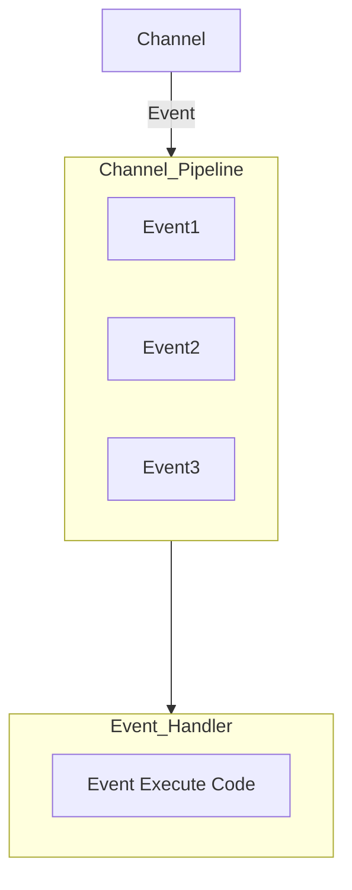
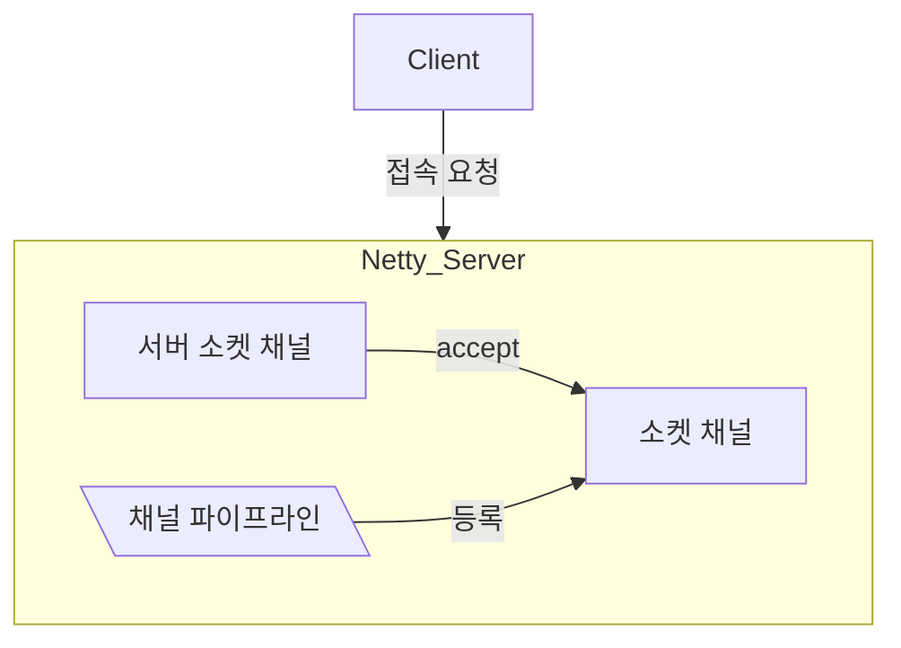
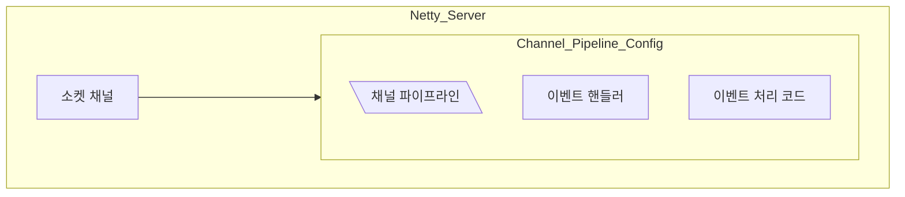
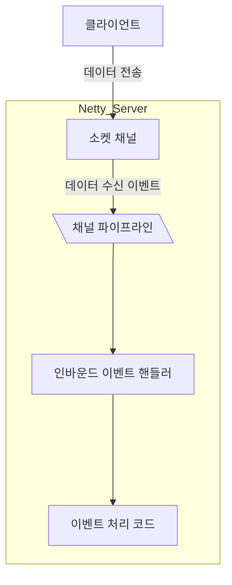
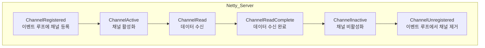

# Part2 Chapter4 채널 파이프라인, 코덱

## 4.1 이벤트 실행 

일반 서버 네트워크 프로그램 로직 구현 예시
1. 소켓에 데이터가 있는지 확인한다
2. 1에서 데이터가 존재하면 데이터를 읽어들이는 메서드를 호출
3. 읽어들일 데이터가 존재하지 않는다면 데이터가 도착할 때까지 기다린다
4. 데이터를 기다리는 중에 네트워크가 끊어지면 에러 처리를 위한 메서드를 호출한다

예외 대비가 철저할수록 오류는 적어지지만 복잡도는 증가  

이와 같은 관점에서 네티는 이벤트를 채널 파이프라인과 이벤트 핸들러로 추상화  
따라서 네티를 사용하면 데이터가 수신되었는지 소켓의 연결이 끊어졌는지와 같은 예외 상태에서 메서드 호출에 관여할 필요가 없다

앞에서 언급한 서버 네트워크 어플리케이션을 네티로 작성하면 다음과 같다
1. 부트스트랩으로 네트워크 어플리케이션에 필요한 설정을 지정
2. 부트스트랩에 이벤트 핸들러를 사용하여 채널 파이프라인을 구성
3. 이벤트 핸들러의 데이터 수신 이벤트 메서드에서 데이터를 읽어들인다
4. 이벤트 핸들러의 네트워크 끊김 이벤트 메서드에서 에러 처리를 한다

이벤트 메서드를 실행하는 방법
1. 네티의 이벤트 루프가 채널 파이프라인에 등록된 첫 번째 이벤트 핸들러를 가져온다
2. 이벤트 핸들러에 데이터 수신 이벤트 메서드가 구현되어 있으면 실행한다
3. 데이터 수신 이벤트 메서드가 구현되어 있지 않으면 다음 이벤트 핸들러를 가져온다
4. 2를 수행
5. 채널 파이프라인에 등록된 마지막 이벤트 핸들러에 도달할 때까지 1을 반복

## 4.2 채널 파이프라인

### 4.2.1 채널 파이프라인의 구조



### 4.2.2 채널 파이프라인 동작

1. 클라이언트 연결에 대응하는 소켓 채널 객체를 생성하고 빈 채널 파이프라인 객체를 생성하여 소켓 채널에 할당한다


2. 소켓 채널에 등록된 ChannelInitializer 인터페이스 구현체를 가져와서 initChannel 메서드를 호출한다

3. 소켓 채널 참조로부터 1에서 등록한 파이프라인 객체를 가져오고 채널 파이프라인에 입력된 이벤트 핸들러의 객체를 등록한다


세 단계 완료시 채널이 등록됐다는 이벤트가 발생  
이때부터 클라이언트 서버 간의 데이터 송수신을 위한 이벤트 처리가 시작

## 4.3 이벤트 핸들러

네티는 비동기 호출을 지원하는 두가지 패턴을 제공, Future Pattern, Reactor Pattern의 구현체인 이벤트 핸들러

1. 소켓 채널의 이벤트를 인터페이스로 정의하고   
2. 이를 상속 받은 이벤트 핸들러를 작성  
3. 채널 파이프라인에 등록  
4. 파이프라인으로 입력되는 이벤트를 이벤트 루프가 가로채어  
5. 이벤트에 해당하는 메서드를 수행하는 구조

### 4.3.1 채널 인바운드 이벤트

네티는 인바운드 이벤트를 ChannelInboundHandler 인터페이스로 제공



```java
package io.netty.channel;

/**
 * {@link ChannelHandler} which adds callbacks for state changes. This allows the user
 * to hook in to state changes easily.
 */
public interface ChannelInboundHandler extends ChannelHandler {

    /**
     * The {@link Channel} of the {@link ChannelHandlerContext} was registered with its {@link EventLoop}
     */
    void channelRegistered(ChannelHandlerContext ctx) throws Exception;

    /**
     * The {@link Channel} of the {@link ChannelHandlerContext} was unregistered from its {@link EventLoop}
     */
    void channelUnregistered(ChannelHandlerContext ctx) throws Exception;

    /**
     * The {@link Channel} of the {@link ChannelHandlerContext} is now active
     */
    void channelActive(ChannelHandlerContext ctx) throws Exception;

    /**
     * The {@link Channel} of the {@link ChannelHandlerContext} was registered is now inactive and reached its
     * end of lifetime.
     */
    void channelInactive(ChannelHandlerContext ctx) throws Exception;

    /**
     * Invoked when the current {@link Channel} has read a message from the peer.
     */
    void channelRead(ChannelHandlerContext ctx, Object msg) throws Exception;

    /**
     * Invoked when the last message read by the current read operation has been consumed by
     * {@link #channelRead(ChannelHandlerContext, Object)}.  If {@link ChannelOption#AUTO_READ} is off, no further
     * attempt to read an inbound data from the current {@link Channel} will be made until
     * {@link ChannelHandlerContext#read()} is called.
     */
    void channelReadComplete(ChannelHandlerContext ctx) throws Exception;

    /**
     * Gets called if an user event was triggered.
     */
    void userEventTriggered(ChannelHandlerContext ctx, Object evt) throws Exception;

    /**
     * Gets called once the writable state of a {@link Channel} changed. You can check the state with
     * {@link Channel#isWritable()}.
     */
    void channelWritabilityChanged(ChannelHandlerContext ctx) throws Exception;

    /**
     * Gets called if a {@link Throwable} was thrown.
     */
    @Override
    @SuppressWarnings("deprecation")
    void exceptionCaught(ChannelHandlerContext ctx, Throwable cause) throws Exception;
}
```

클라이언트 접속, 데이터 전송, 연결 종료시 이벤트 흐름



1. ChannelRegistered
    - 서버와 클라이언트 상관없이 새로운 채널이 생성되는 시점에 발생한다
    - ```mermaid
        flowchart TD
        SSC_GEN[서버 소켓 채널\n생성 및 이벤트 루프 등록]
        SSC_REG[서버 소켓 채널\n**channelRegistered 이벤트]
        SSC_IDLE[서버 소켓 채널\naccept 대기]
        CLSC_GEN_ON_SV[클라이언트 소켓 채널\n생성 및 이벤트 루프 등록]
        CLSC_REG_ON_SV[클라이언트 소켓 채널\n**channelRegistered 이벤트]

        CN[connect 호출]
        CLSC_GEN_ON_CL[클라이언트 소켓 채널\n생성 및 이벤트 루프 등록]
        CLSC_REG_ON_CL[클라이언트 소켓 채널\n**channelRegistered 이벤트]

        SSC_GEN --> SSC_REG
        SSC_REG --> SSC_IDLE
        SSC_IDLE --accept--> CLSC_GEN_ON_SV
        CLSC_GEN_ON_SV ----> CLSC_REG_ON_SV

        CN --> CLSC_GEN_ON_CL
        CLSC_GEN_ON_CL --> CLSC_REG_ON_CL

        CLSC_REG_ON_CL --연결요청--> SSC_IDLE

            subgraph Netty_Server
                SSC_GEN
                SSC_REG
                SSC_IDLE
                CLSC_GEN_ON_SV
                CLSC_REG_ON_SV
            end

            subgraph Netty_Client
                CN
                CLSC_GEN_ON_CL
                CLSC_REG_ON_CL
            end    
        ```
2. ChannelActive
    - 채널이 생성되고 이벤트 루프에 등록된 이후에 네티 API를 사용하여 채널 입출력을 수행할 상태가 되었음을 알려주는 이벤트
    - 적합한 작업 예시
      - 서버 어플리케이션에 연결된 클라이언트의 연결 개수를 셀 때
      - 서버 어플리케이션에 연결된 클라이언트에게 최초 연결에 대한 메시지 전송
      - 클라이언트 어플리케이션이 연결된 서버에 최초 메세지 전송
      - 클라이언트 어플리케이션에서 서버에 연결된 상태에 대한 작업이 필요할 때
3. ChannelRead
    - 데이터 수신시 이벤트 발생
4. ChannelReadComplete
    - 데이터 수신 완료시 이벤트 발생
    - channelRead 이벤트는 채널에 데이터가 있을 때 발생, 채널의 데이터를 다 읽어서 더 이상 데이터가 없을 때 channelReadComplete 이벤트 발생
5. ChannelInactive
    - 채널이 비활성화 되었을 때 발생
    - 해당 이벤트 이후에는 채널에 대한 입출력 작업을 수행할 수 없다
6. ChannelUnregistered
    - 채널이 이벤트 루프에서 제거되었을 때 발생
    - 해당 이벤트 이후에는 채널에서 발생한 이벤트를 처리할 수 없다
