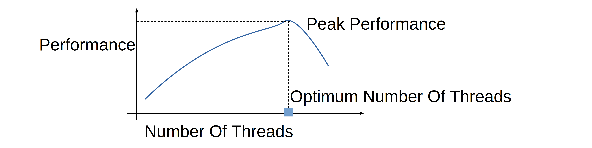
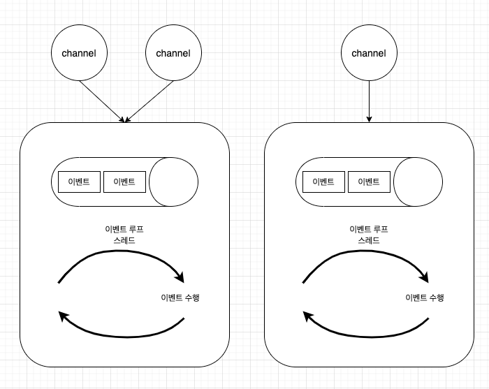

# Part2 Chapter5 이벤트 모델

## 5.1 이벤트 루프

이벤트 루프 
- 이벤트를 실행하기 위한 무한루프 스레드
- 객체에서 발생한 이벤트 큐에 입력, 이벤트 루프는 이벤트 큐에 입력된 이벤트가 있을 때 해당 이벤트를 꺼내서 이벤트를 실행
- 이벤트 루프가 지원하는 스레드 종류에 따라 아래와 같이 나뉨
  - 단일 스레드 이벤트 루프
  - 다중 스레드 이벤트 루프
- 이벤트 루프가 처리한 이벤트의 결과를 돌려주는 방식에 따라서 아래와 같이 나뉨, 네티는 두가지 패턴 모두 지원
  - 콜백(Callback) 패턴
  - 퓨처(Future) 패턴

### 5.1.1 단일 스레드와 다중 스레드 이벤트 루프

#### 단일 스레드 이벤트 루프

이벤트를 처리하는 스레드가 하나

장점
- 이벤트 루프의 구현이 단순
- 예측 가능한 동작을 보장
- 하나의 스레드가 이벤트 큐에 입력된 이벤트를 처리하므로 이벤트가 발생한 순서대로 수행

단점
- 다중 코어 CPU를 효율적으로 사용하지 못함
- 이벤트 메서드에 처리 시간이 오래 걸리는 작업이 섞여 있을 때 나중에 들어온 이벤트 처리까지 더 오랜 시간이 걸린다

#### 다중 스레드 이벤트 루프

이벤트를 처리하는 스레드가 여러 개

장점
- 이벤트 루프 스레드들이 이벤트 메서드를 병렬로 수행하므로 다중 코어 CPU를 효율적으로 사용
- 더 많은 이벤트를 빠른 시간안에 처리
  - 시간이 많이 걸리는 작업을 여러 스레드로 분할 처리하여 전체 처리 시간을 단축

단점
- 단일에 비해 구현의 복잡성
- 여러 이벤트 루프 스레드가 하나의 이벤트 큐에 접근하므로 발생하는 스레드 경합이 발생
- 여러 스레드가 이벤트 메서드를 수행하므로 이벤트 발생 순서와 실행 순서가 일치하지 않는다
- 다중 스레드 장점을 얻기 위해 스레드 개수를 너무 많이 설정하거나 스레드 개수를 제한하지 않는 실수
  - 과도한 GC 발생하는 원인이 되거나 OOM 에러를 발생시켜 어플리케이션이 정상적으로 동작하지 못하게 함
- 스레드 경합
  - 스레드 경합은 CPU를 소비, 스레드가 많아질수록 스레드 경합에 더 많은 CPU 자원을 사용
- 컨텍스트 스위칭 비용
  - 하나의 CPU 코어는 동시에 하나의 스레드만 실행, 4코어 = 동시에 실행할 수 있는 스레드 개수 4개
  - 스레드는 실행(Run), 대기(Waiting), 준비(Ready), 슬립(Sleep), 지연(Blocked) 상태를 가짐
  - OS 현재 상태가 대기, 슬립, 지연인 스레드 중의 하나를 선택하여 실행 상태로 변경
  - 스레드가 가진 스택 정보를 현재 코어의 레지스터로 복사하는 작업이 이루어지며 이것을 컨텍스트 스위칭이라 한다


*스레드 개수에 따른 전체 처리량*
*[[baeldung] Servers threads number](https://www.baeldung.com/cs/servers-threads-number)*

> Thread의 수가 증가할수록 CPU Utilization이 증가한다.
> - Thread switching 때문에, 임계값을 넘어가면 CPU Utilization이 다시 감소한다.

*[[bycho211] - Thread](https://m.blog.naver.com/bycho211/220994380643)*

## 5.2 네티의 이벤트 루프

네티는 이벤트 루프의 종류에 상관 없이 이벤트 발생 순서에 따른 실행 순서를 보장

- 네티의 이벤트는 채널에서 발생한다
- 이벤트 루프 객체는 이벤트 큐를 가지고 있다
- 네티의 채널은 하나의 이벤트 루프에 등록된다


*[Netty의 스레드 모델](https://effectivesquid.tistory.com/65)*

네티의 각 채널은 개별 이벤트 루프 스레드에 등록된다  
따라서 채널에서 발생한 이벤트는 항상 동일한 이벤트 루프 스레드에서 처리하여 이벤트 발생 순서와 처리 순서가 일치

이벤트의 수행 순서가 일치하지 않는 이유는 이벤트 루프들이 이벤트 큐를 공유하여 발생  
네티는 이벤트 큐를 이벤트 루프 스레드의 내부에 둠으로써 수행 순서 불일치의 원인을 제거

네티는 이벤트를 처리하기 위하여 SingleThreadEventExecutor를 사용

```java
public abstract class SingleThreadEventExecutor extends AbstractScheduledEventExecutor implements OrderedEventExecutor {
    
  private final Queue<Runnable> taskQueue; // 발생된 이벤트를 저장할 이벤트 큐, 이벤트를 task 이름으로 선언하여 처리 

  /**
   * Create a new {@link Queue} which will holds the tasks to execute. This default implementation will return a
   * {@link LinkedBlockingQueue} but if your sub-class of {@link SingleThreadEventExecutor} will not do any blocking
   * calls on the this {@link Queue} it may make sense to {@code @Override} this and return some more performant
   * implementation that does not support blocking operations at all.
   */
  protected Queue<Runnable> newTaskQueue(int maxPendingTasks) { // 이벤트 큐 구현체 LinkedBlockingQueue 사용
    return new LinkedBlockingQueue<Runnable>(maxPendingTasks); // Runnable 객체 형태의 이벤트를 저장
  }

  /**
   * @see Queue#poll()
   */
  protected Runnable pollTask() { // taskQueue에 입력된 이벤트 하나를 가져옴
    assert inEventLoop();
    return pollTaskFrom(taskQueue);
  }

  protected static Runnable pollTaskFrom(Queue<Runnable> taskQueue) {
    for (;;) {
      Runnable task = taskQueue.poll();
      if (task != WAKEUP_TASK) {
        return task;
      }
    }
  }

  /**
   * Poll all tasks from the task queue and run them via {@link Runnable#run()} method.
   *
   * @return {@code true} if and only if at least one task was run
   */
  protected boolean runAllTasks() { //  이벤트 큐에 입력된 모든 이벤트를 수행
    assert inEventLoop();
    boolean fetchedAll;
    boolean ranAtLeastOne = false;

    do {
      fetchedAll = fetchFromScheduledTaskQueue();
      if (runAllTasksFrom(taskQueue)) {
        ranAtLeastOne = true;
      }
    } while (!fetchedAll); // keep on processing until we fetched all scheduled tasks.

    if (ranAtLeastOne) {
      lastExecutionTime = getCurrentTimeNanos();
    }
    afterRunningAllTasks();
    return ranAtLeastOne;
  }

  /**
   * Runs all tasks from the passed {@code taskQueue}.
   *
   * @param taskQueue To poll and execute all tasks.
   *
   * @return {@code true} if at least one task was executed.
   */
  protected final boolean runAllTasksFrom(Queue<Runnable> taskQueue) {
    Runnable task = pollTaskFrom(taskQueue);
    if (task == null) {
      return false;
    }
    for (;;) {
      safeExecute(task);
      task = pollTaskFrom(taskQueue);
      if (task == null) {
        return true;
      }
    }
  }

  /**
   * Try to execute the given {@link Runnable} and just log if it throws a {@link Throwable}.
   */
  protected static void safeExecute(Runnable task) {
    try {
      runTask(task);
    } catch (Throwable t) {
      logger.warn("A task raised an exception. Task: {}", task, t);
    }
  }

  protected static void runTask(@Execute Runnable task) {
    task.run();
  }
  
}
```
