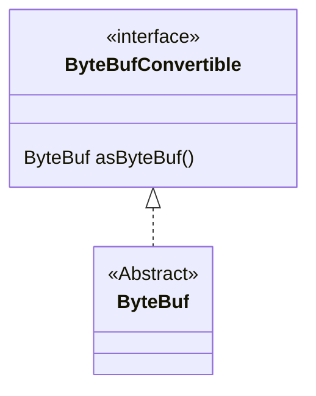

# Buffer

ByteBufConvertible

An interface that can be implemented by any object that know how to turn itself into a {@link ByteBuf}.  
All {@link ByteBuf} classes implement this interface, and return themselves.  

- asByteBuf()

Turn this object into a {@link ByteBuf}.  
This does <strong>not</strong> increment the reference count of the {@link ByteBuf} instance.  
The conversion or exposure of the {@link ByteBuf} must be idempotent, so that this method can be called  
either once, or multiple times, without causing any change in program behaviour.

@return A {@link ByteBuf} instance from this object.  

ByteBuf

A random and sequential accessible sequence of zero or more bytes (octets).
This interface provides an abstract view for one or more primitive byte
arrays ({@code byte[]}) and {@linkplain ByteBuffer NIO buffers}.

<h3>Creation of a buffer</h3>

It is recommended to create a new buffer using the helper methods in
{@link Unpooled} rather than calling an individual implementation's
constructor.

<h3>Random Access Indexing</h3>

Just like an ordinary primitive byte array, {@link ByteBuf} uses
<a href="https://en.wikipedia.org/wiki/Zero-based_numbering">zero-based indexing</a>.
It means the index of the first byte is always {@code 0} and the index of the last byte is
always {@link #capacity() capacity - 1}.  For example, to iterate all bytes of a buffer, you
can do the following, regardless of its internal implementation:

<pre>
{@link ByteBuf} buffer = ...;
for (int i = 0; i &lt; buffer.capacity(); i ++) {
    byte b = buffer.getByte(i);
    System.out.println((char) b);
}
</pre>

<h3>Sequential Access Indexing</h3>

{@link ByteBuf} provides two pointer variables to support sequential
read and write operations - {@link #readerIndex() readerIndex} for a read
operation and {@link #writerIndex() writerIndex} for a write operation
respectively.  The following diagram shows how a buffer is segmented into
three areas by the two pointers:

<pre>
     +-------------------+------------------+------------------+
     | discardable bytes |  readable bytes  |  writable bytes  |
     |                   |     (CONTENT)    |                  |
     +-------------------+------------------+------------------+
     |                   |                  |                  |
     0      <=      readerIndex   <=   writerIndex    <=    capacity
</pre>

<h4>Readable bytes (the actual content)</h4>

This segment is where the actual data is stored.  Any operation whose name
starts with {@code read} or {@code skip} will get or skip the data at the
current {@link #readerIndex() readerIndex} and increase it by the number of
read bytes.  If the argument of the read operation is also a
{@link ByteBuf} and no destination index is specified, the specified
buffer's {@link #writerIndex() writerIndex} is increased together.

If there's not enough content left, {@link IndexOutOfBoundsException} is
raised.  The default value of newly allocated, wrapped or copied buffer's
{@link #readerIndex() readerIndex} is {@code 0}.

<pre>
// Iterates the readable bytes of a buffer.
{@link ByteBuf} buffer = ...;
while (buffer.isReadable()) {
    System.out.println(buffer.readByte());
}
</pre>

<h4>Writable bytes</h4>

This segment is a undefined space which needs to be filled.  Any operation
whose name starts with {@code write} will write the data at the current
{@link #writerIndex() writerIndex} and increase it by the number of written
bytes.  If the argument of the write operation is also a {@link ByteBuf},
and no source index is specified, the specified buffer's
{@link #readerIndex() readerIndex} is increased together.

If there's not enough writable bytes left, {@link IndexOutOfBoundsException}
is raised.  The default value of newly allocated buffer's
{@link #writerIndex() writerIndex} is {@code 0}.  The default value of
wrapped or copied buffer's {@link #writerIndex() writerIndex} is the
{@link #capacity() capacity} of the buffer.

<pre>
// Fills the writable bytes of a buffer with random integers.
{@link ByteBuf} buffer = ...;
while (buffer.maxWritableBytes() >= 4) {
    buffer.writeInt(random.nextInt());
}
</pre>

<h4>Discardable bytes</h4>

This segment contains the bytes which were read already by a read operation.
Initially, the size of this segment is {@code 0}, but its size increases up
to the {@link #writerIndex() writerIndex} as read operations are executed.
The read bytes can be discarded by calling {@link #discardReadBytes()} to
reclaim unused area as depicted by the following diagram:

<pre>
 BEFORE discardReadBytes()

     +-------------------+------------------+------------------+
     | discardable bytes |  readable bytes  |  writable bytes  |
     +-------------------+------------------+------------------+
     |                   |                  |                  |
     0      <=      readerIndex   <=   writerIndex    <=    capacity

 AFTER discardReadBytes()

     +------------------+--------------------------------------+
     |  readable bytes  |    writable bytes (got more space)   |
     +------------------+--------------------------------------+
     |                  |                                      |
readerIndex (0) <= writerIndex (decreased)        <=        capacity
</pre>

Please note that there is no guarantee about the content of writable bytes
after calling {@link #discardReadBytes()}.  The writable bytes will not be
moved in most cases and could even be filled with completely different data
depending on the underlying buffer implementation.

<h4>Clearing the buffer indexes</h4>

You can set both {@link #readerIndex() readerIndex} and
{@link #writerIndex() writerIndex} to {@code 0} by calling {@link #clear()}.
It does not clear the buffer content (e.g. filling with {@code 0}) but just
clears the two pointers.  Please also note that the semantic of this
operation is different from {@link ByteBuffer#clear()}.

<pre>
 BEFORE clear()

     +-------------------+------------------+------------------+
     | discardable bytes |  readable bytes  |  writable bytes  |
     +-------------------+------------------+------------------+
     |                   |                  |                  |
     0      <=      readerIndex   <=   writerIndex    <=    capacity

 AFTER clear()

     +---------------------------------------------------------+
     |             writable bytes (got more space)             |
     +---------------------------------------------------------+
     |                                                         |
     0 = readerIndex = writerIndex            <=            capacity
</pre>

<h3>Search operations</h3>

For simple single-byte searches, use {@link #indexOf(int, int, byte)} and {@link #bytesBefore(int, int, byte)}.
{@link #bytesBefore(byte)} is especially useful when you deal with a {@code NUL}-terminated string.
For complicated searches, use {@link #forEachByte(int, int, ByteProcessor)} with a {@link ByteProcessor}
implementation.

<h3>Mark and reset</h3>

There are two marker indexes in every buffer. One is for storing
{@link #readerIndex() readerIndex} and the other is for storing
{@link #writerIndex() writerIndex}.  You can always reposition one of the
two indexes by calling a reset method.  It works in a similar fashion to
the mark and reset methods in {@link InputStream} except that there's no
{@code readlimit}.

<h3>Derived buffers</h3>

You can create a view of an existing buffer by calling one of the following methods:
<ul>
  <li>{@link #duplicate()}</li>
  <li>{@link #slice()}</li>
  <li>{@link #slice(int, int)}</li>
  <li>{@link #readSlice(int)}</li>
  <li>{@link #retainedDuplicate()}</li>
  <li>{@link #retainedSlice()}</li>
  <li>{@link #retainedSlice(int, int)}</li>
  <li>{@link #readRetainedSlice(int)}</li>
</ul>
A derived buffer will have an independent {@link #readerIndex() readerIndex},
{@link #writerIndex() writerIndex} and marker indexes, while it shares
other internal data representation, just like a NIO buffer does.

In case a completely fresh copy of an existing buffer is required, please
call {@link #copy()} method instead.

<h4>Non-retained and retained derived buffers</h4>

Note that the {@link #duplicate()}, {@link #slice()}, {@link #slice(int, int)} and {@link #readSlice(int)} does NOT
call {@link #retain()} on the returned derived buffer, and thus its reference count will NOT be increased. If you
need to create a derived buffer with increased reference count, consider using {@link #retainedDuplicate()},
{@link #retainedSlice()}, {@link #retainedSlice(int, int)} and {@link #readRetainedSlice(int)} which may return
a buffer implementation that produces less garbage.

<h3>Conversion to existing JDK types</h3>

<h4>Byte array</h4>

If a {@link ByteBuf} is backed by a byte array (i.e. {@code byte[]}),
you can access it directly via the {@link #array()} method.  To determine
if a buffer is backed by a byte array, {@link #hasArray()} should be used.

<h4>NIO Buffers</h4>

If a {@link ByteBuf} can be converted into an NIO {@link ByteBuffer} which shares its
content (i.e. view buffer), you can get it via the {@link #nioBuffer()} method.  To determine
if a buffer can be converted into an NIO buffer, use {@link #nioBufferCount()}.

<h4>Strings</h4>

Various {@link #toString(Charset)} methods convert a {@link ByteBuf}
into a {@link String}.  Please note that {@link #toString()} is not a
conversion method.

<h4>I/O Streams</h4>

Please refer to {@link ByteBufInputStream} and
{@link ByteBufOutputStream}.

